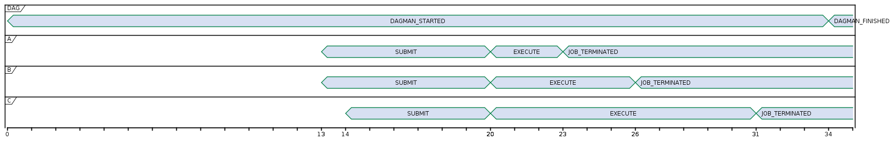
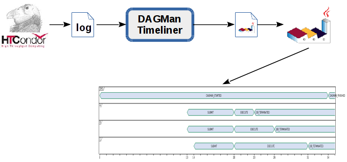

# DAGMan-Timeliner

Create timelines from 
[HTCondor DAGMan](http://research.cs.wisc.edu/htcondor/manual/latest/2_10DAGMan_Applications.html)  logs.

## Example

The following timeline



was generated running

```bash
./dagman-timeliner -in jobsatate.log -ignore IMAGE_SIZE
```

from the `jobsatate.log` file:

```
1488716777 INTERNAL *** DAGMAN_STARTED 121.0 ***
1488716790 A SUBMIT 122.0 - - 1
1488716790 B SUBMIT 123.0 - - 2
1488716791 C SUBMIT 124.0 - - 3
1488716797 A EXECUTE 122.0 - - 1
1488716797 B EXECUTE 123.0 - - 2
1488716797 C EXECUTE 124.0 - - 3
1488716799 A IMAGE_SIZE 122.0 - - 1
1488716800 A JOB_TERMINATED 122.0 - - 1
1488716800 A JOB_SUCCESS 0 - - 1
1488716803 B IMAGE_SIZE 123.0 - - 2
1488716803 B JOB_TERMINATED 123.0 - - 2
1488716803 B JOB_SUCCESS 0 - - 2
1488716806 C IMAGE_SIZE 124.0 - - 3
1488716808 C JOB_TERMINATED 124.0 - - 3
1488716808 C JOB_SUCCESS 0 - - 3
1488716811 INTERNAL *** DAGMAN_FINISHED 0 ***
```

DAGMan-Timeliner does not generate itself the image but 
[PlantUML](http://plantuml.com/)-compatible code.

The complete workflow for obtain a timeline diagram is:



```bash
Usage of ./dagman-timeliner:
  -ignore string
        comma separated list of events to ignore, ex. IMAGE_SIZE,JOB_SUCCESS
  -in string
        filepath of the DAG jobstate_log
  -out string
        output filepath (defaults to stdout)
```

